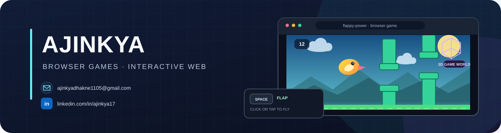

  

  I build interactive web experiences and useful tools, including <a href="https://github.com/coder-bat01/leetcoach-ai">LeetCoach AI</a>.

<a href="mailto:ajinkyadhakne1105@gmail.com">Email</a> · <a href="https://www.linkedin.com/in/ajinkya17">LinkedIn</a>

## ⚡ Featured projects

### [Flappy Power](https://github.com/coder-bat01/flappy-power)

A 3D browser game inspired by Flappy Bird, with procedural scenery, synthesized sound effects, and three gameplay power-ups.

**Built with:** JavaScript · Three.js · Vite · Web Audio API

[Explore the project →](https://github.com/coder-bat01/flappy-power)

### [LeetCoach AI](https://github.com/coder-bat01/leetcoach-ai)

A self-hosted LeetCode coach for interview preparation, with progress tracking, weakness analysis, company prep, interview-readiness scoring, and AI-powered study plans.

**Built with:** Next.js · React · TypeScript · Express · PostgreSQL · Redis

[Explore the project →](https://github.com/coder-bat01/leetcoach-ai)

---

Thanks for stopping by 👋

